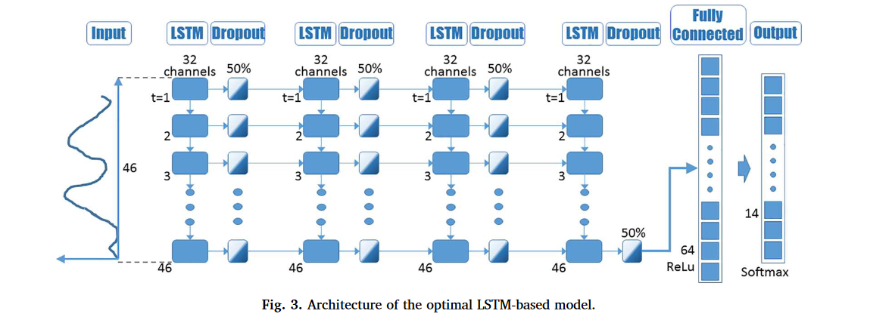

# LSTM
>[keras code](https://rramosp.github.io/2021.deeplearning/content/U5.02%20-%20Long%20Short%20Term%20Memory%20RNN.html)
>[understand the lstm](https://colah.github.io/posts/2015-08-Understanding-LSTMs/)

在LSTM模型中，每个隐藏层的通道数目==通常是一致的==，这是因为LSTM模型的结构决定了每个隐藏层内部的结构是相同的。具体来说，每个LSTM层内部包含了多个LSTM单元（cell），每个LSTM单元中都有一组相同的参数（如遗忘门、输入门、输出门等），这些参数的数量决定了隐藏层的通道数目



# 资源
https://paddlepedia.readthedocs.io/en/latest/tutorials/CNN/convolution_operator/3D_Convolution.html


# 学习率
```python
    def cosine_learning_rate(epoch, initial_lr=0.0001, total_epochs=30):
        lr = initial_lr * 0.5 * (1 + tf.math.cos(epoch / total_epochs * 3.1415))
        return lr


```

