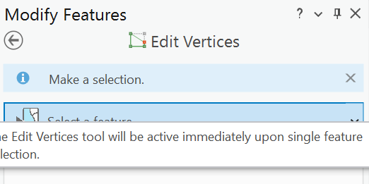
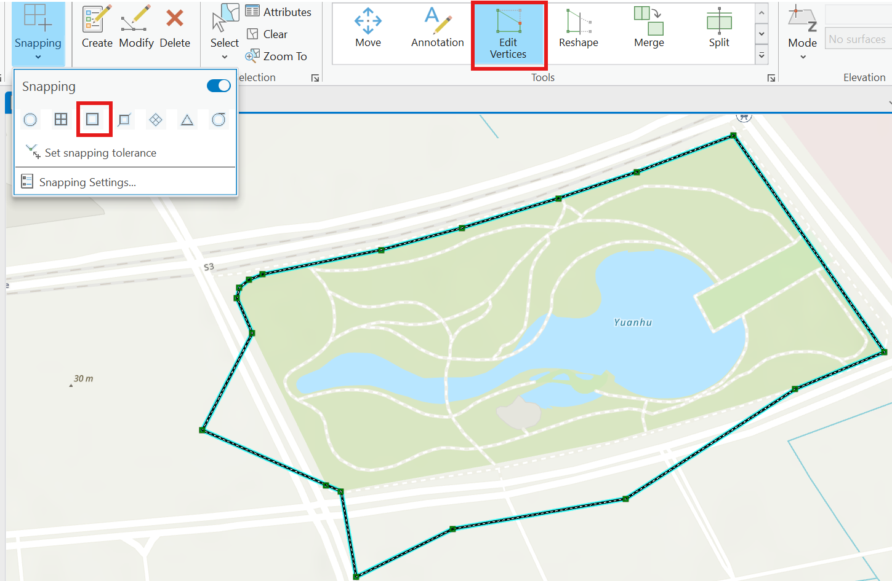
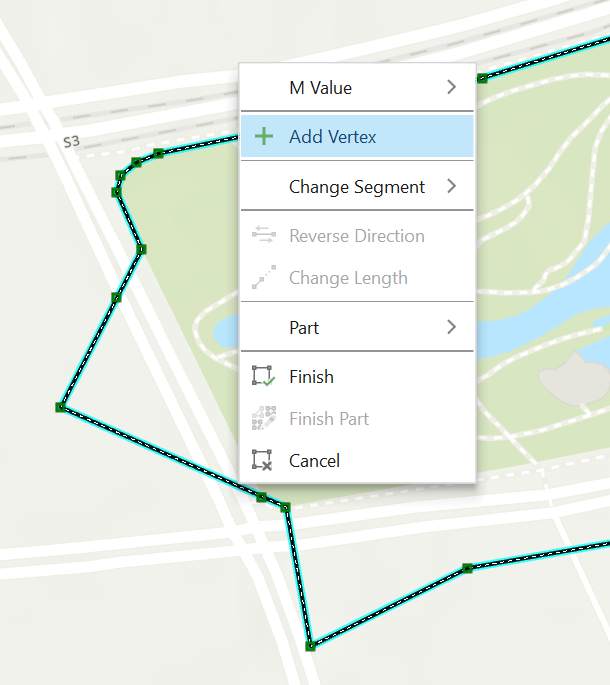
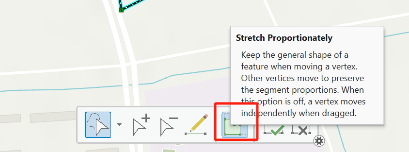
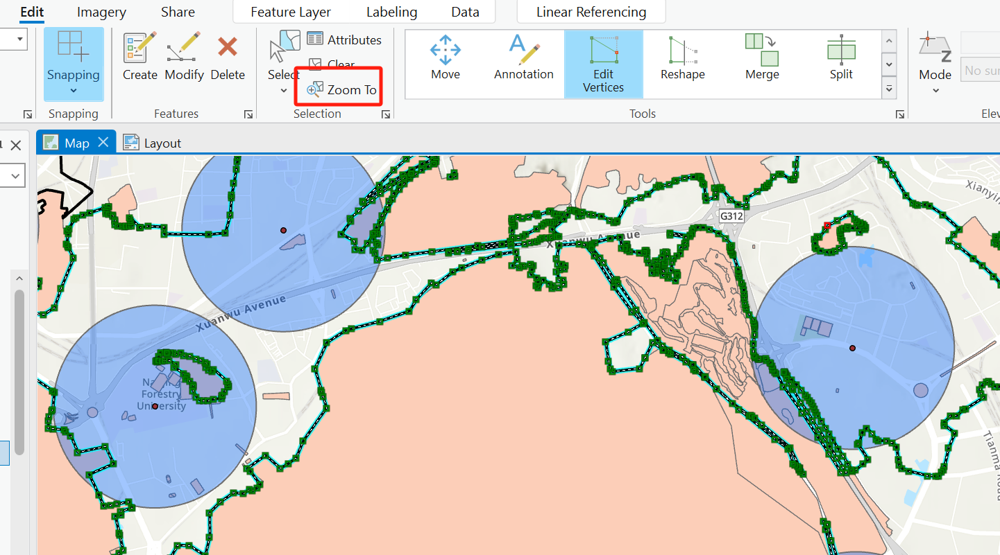

# Edit
Edit tool select the feature you want to edit,open snapping. 
right click the feature, add vertice, then move the vertice to the places you want. To advoid moving the whole feature, close the ==Stretch proportionately==option.

the "zoom to" in edit tool will set the center of view to the feature you select even though you are in edge.

### [shortcut in editing](https://pro.arcgis.com/en/pro-app/latest/help/editing/keyboard-shortcuts-for-editing.html)
平移[pan]

