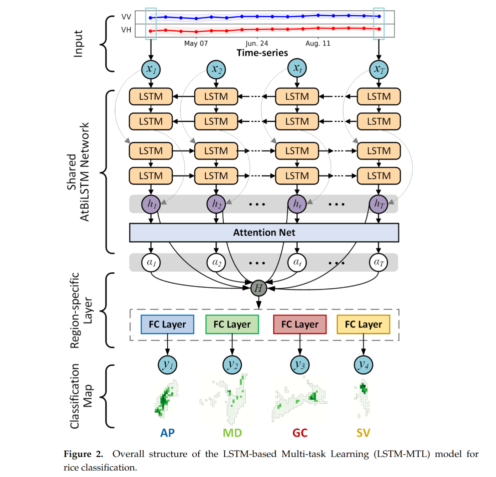
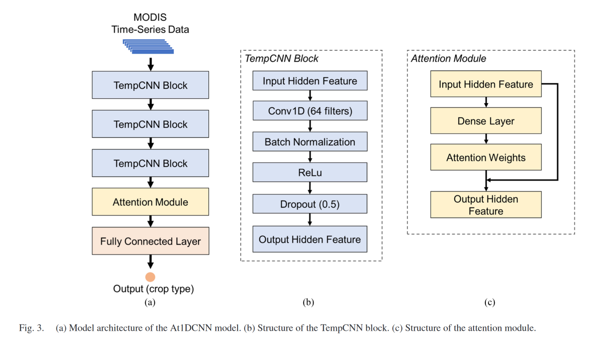
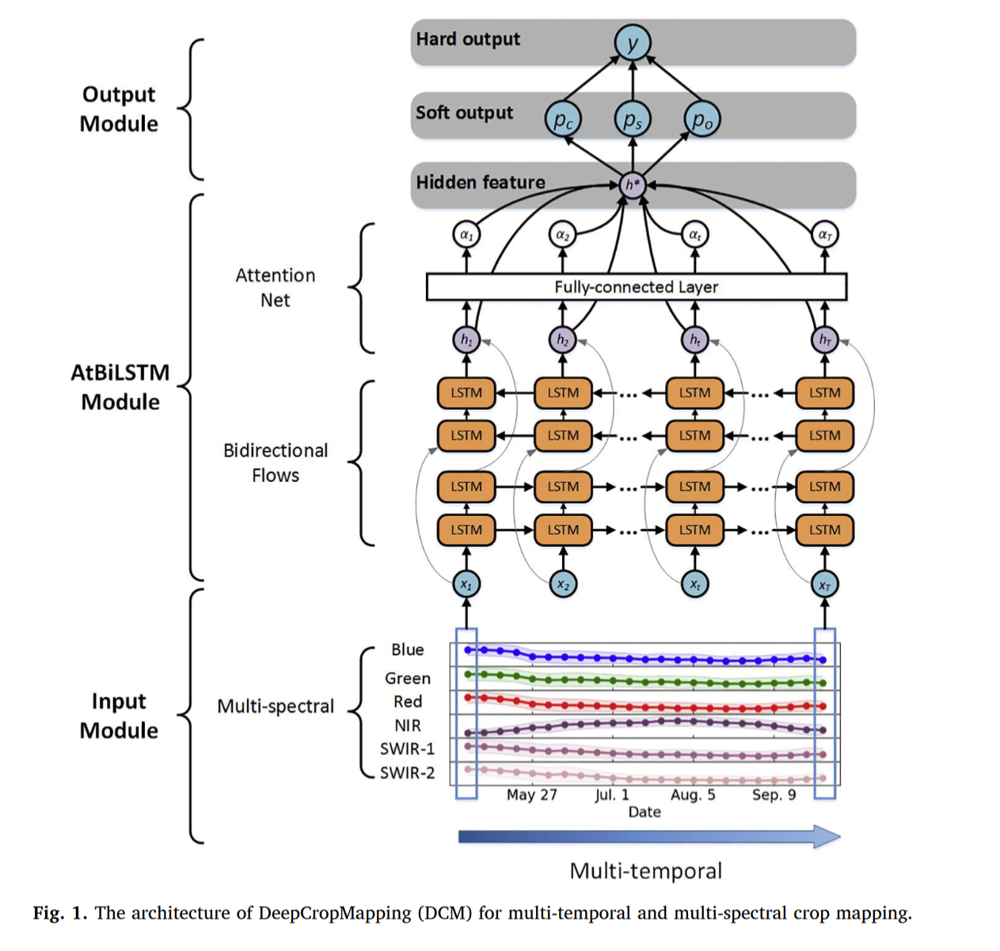

It can be impairedby replacing the original loss function of the network with a focal loss function that reduces the weight of a large number of simple negative samples.

# Time Features module
## TempCNN
==TempCNN只是对时间维度进行了卷积，输入shape(timelength,channels)==
2019-RS-高引-Temporal Convolutional Neural Network for the Classification of Satellite Image Time Series
## Time attention
RS-Large-Scale Rice Mapping Using Multi-Task Spatiotemporal Deep Learning and Sentinel-1 SAR Time Series

2023-Towards Scalable Within-Season Crop Mapping With Phenology Normalization and Deep Learning

**2020-RSE-DeepCropMapping: A multi-temporal deep learning approach with improved spatial generalizability for dynamic corn and soybean mapping**

2024-science reports-==CNN-BiGR==
GOA-optimized deep learning for soybean yield estimation using multi-source remote sensing data

