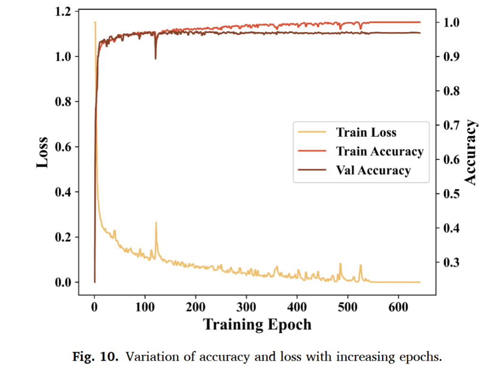
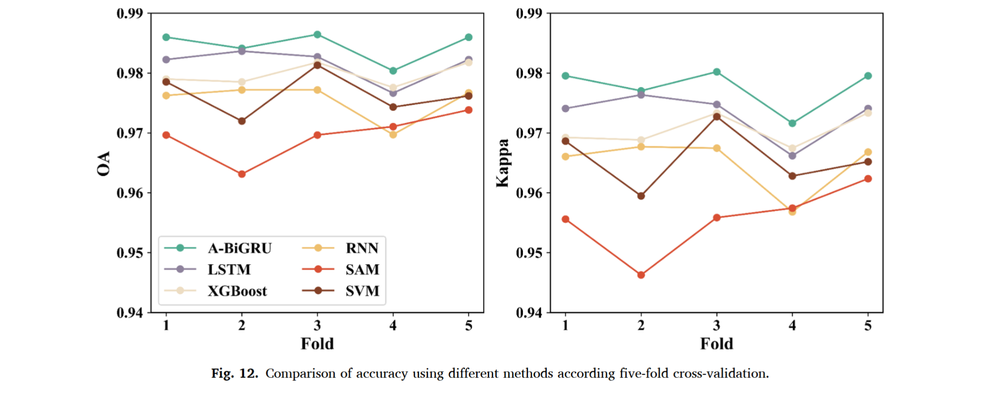
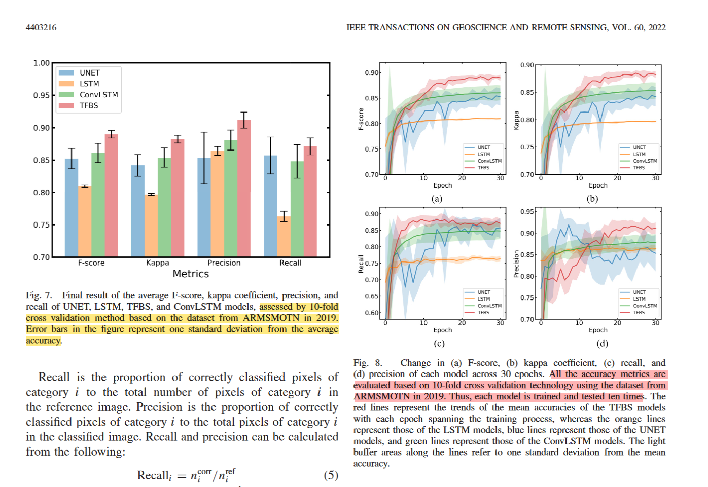

2023-cea2-A deep learning framework for crop mapping with reconstructed Sentinel-2 time series images
本模型训练采用的轮

比较不同模型采用的5fold

2022-1区-Semantic Segmentation Based on Temporal Features: Learning of Temporal–Spatial Information From Time-Series SAR Images for Paddy Rice Mapping
10 fold 训练和验证两个集，验证集用来评估精度.

RS-Evaluation of Five Deep Learning Models for Crop Type Mapping Using Sentinel-2 Time Series Images with Missing Information
==5 folder 70%训练 10%验证 20% test==
==自己随机划分的==

## 消融学习-评价指标提升轻微，但目视效果更好
The addition of PLR leads to only marginal improvements in overall performance, but the improvement in local details is noticeable. Fig. 7 shows the visual changes brought about by PLR. We observe that narrow roads, small crops, and thin rivers are recognized more accurately.
