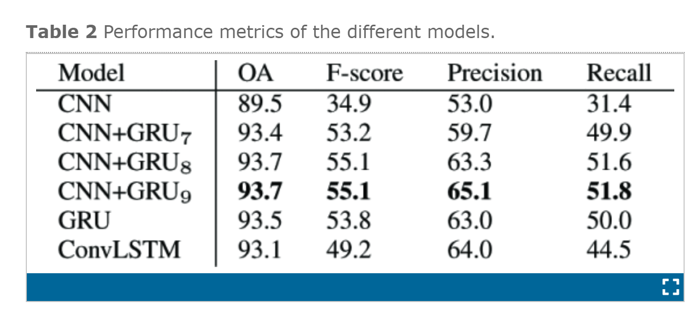
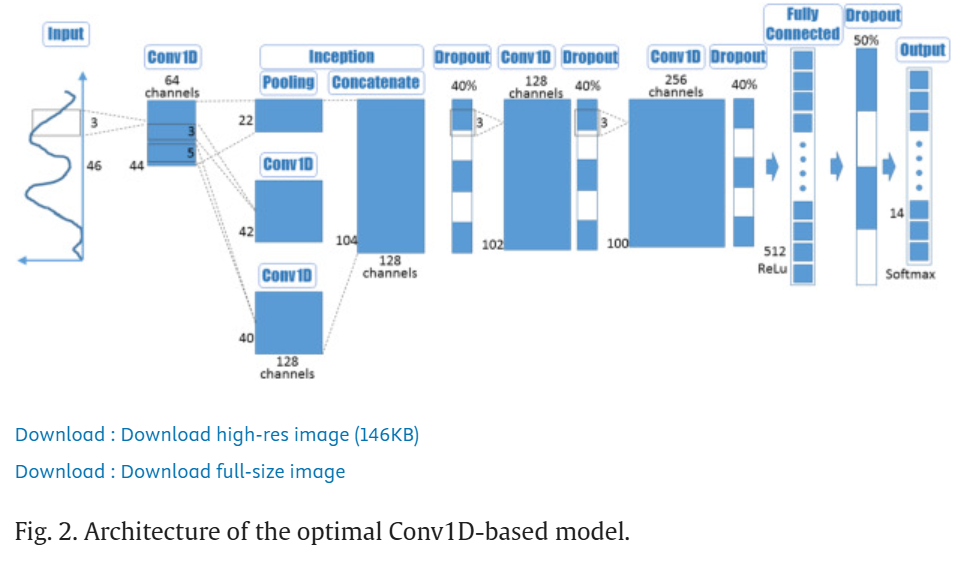

# SAR data的缺点
>Moreover, ==SAR signals may be affected by environmental factors like terrain== and climate conditions. Optimizing the processing of time series SAR data may also improve the derivation of phenological information\
>>Mapping tobacco planting areas in smallholder farmlands using Phenological-Spatial-Temporal LSTM from time-series Sentinel-1 SAR images

# space time information
比较了几个不同的模型

We provide empirical evidence that the ==temporal structure of Sentinel-2 data is richer==than the spatial structure for crop type classification, and, consequently, that most of a model’s complexity should be allocated to it.
>2019-IEEE-Time-Space Tradeoff in Deep Learning Models for Crop Classification on Satellite Multi-Spectral Image Time Series

# why using 3dcnn
>Traditional CNNs mainly designed for RGB images typically use 2-D convolution kernels in convolution layers to glide convolution in space dimension. However, ==the hidden spectral information of crops from multispectral images might be ignored by 2-D CNN==. 3-D CNN architecture used in this module can simultaneously process the spatial and spectral features with 3-D convolutions giving better investments of the few samples available with fewer trainable parameter
>>2020-Cropnet: Deep Spatial-Temporal-Spectral Feature Learning Network for Crop Classification from Time-Series Multi-Spectral Images

# 3D CNN Spatial-temporary
2019-RS-3D Convolutional Neural Networks for Crop Classification with Multi-Temporal Remote Sensing Images

# 3D CNN spatial-spectral
+ ==2021-Computers and Electronics in Agriculture -Deep learning-based crop mapping in the cloudy season using one-shot hyperspectral satellite imagery==
  + 学习写作
  +  1D 2D 3DCNN的比较
+ 2019-sensor-75citation-Learning Deep Hierarchical Spatial–Spectral Features
 for Hyperspectral Image Classification Based on
 Residual 3D-2D CNN
 
+ Hyperspectral image classification method based on M-3DCNN-Attention
  >A convolutional block attention module (CBAM) is added between each 3D convolutional layer and ReLU layer

>Deep learning-based crop mapping in the cloudy season using one-shot hyperspectral satellite imagery
# 文章中引用的其它模型的文献
比较不同模型 https://github.com/eecn/Hyperspectral-Classification
## 2DCNN
K. Makantasis, K. Karantzalos, A. Doulamis, and N. Doulamis, “Deep supervised learning for hyperspectral data classification through convolutional neural networks,” in Proc. IEEE Int. Geosci. Remote Sens. Symp. (IGARSS), Jul. 2015, pp. 4959–4962
>2020-Lightweight Spectral–Spatial Squeeze-andExcitation Residual Bag-of-Features Learning for Hyperspectral Classification

## 3DCNN
A. B. Hamida, A. Benoit, P. Lambert, and C. B. Amar, “3-D deep learning approach for remote sensing image classification,” IEEE Trans. Geosci. Remote Sens., vol. 56, no. 8, pp. 4420–4434, Aug. 2018.
>2020-Lightweight Spectral–Spatial Squeeze-andExcitation Residual Bag-of-Features Learning for Hyperspectral Classification

## 1DCNN
2021-Deep learning based multi-temporal crop classification

>Deep learning-based crop mapping in the cloudy season using one-shot hyperspectral satellite imagery

