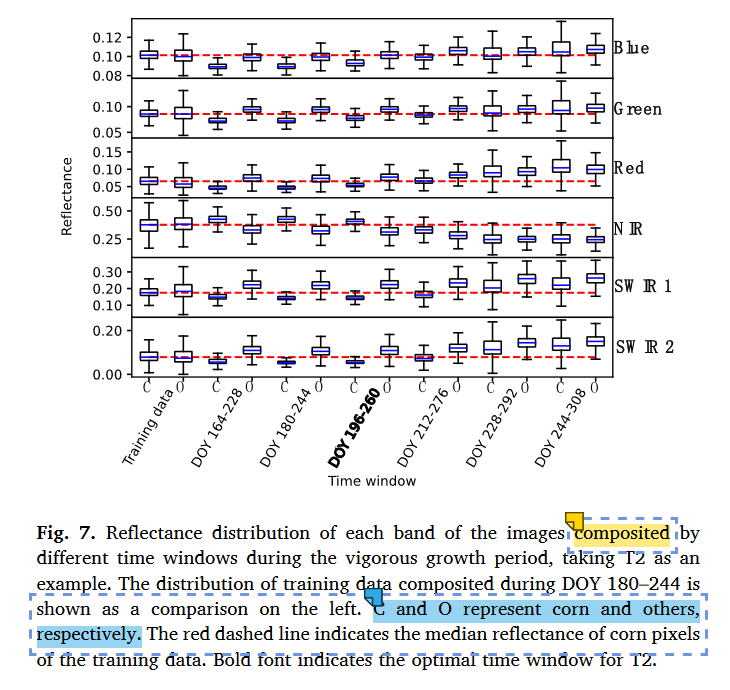

[气象监测](http://www.nmc.cn/)
## 水稻
### 四川
==基于遥感云计算平台的四川盆地水稻种植面积提取==
由于地形起伏对雷达散射特性会产生显著影响，而四川盆地水稻主要种植在平原或平坦的谷地，因此本文在实施SAR数据分析前，首先使用ALOS DEM数据移除四川盆地中坡度大于15°的区域。
根据农业普查数据，确定==四川盆地水稻的移栽窗口为4月15日至5月15日，抽穗窗口为7月15日至8月15日==
在移栽期，水稻植株矮小稀疏，田间积水深度在5 cm以上，水稻种植区域通常呈现出平静水体的低VH后向散射特征。==在抽穗期，水稻植株高大密集，田间积水基本消失，水稻种植区域通常呈现出茂密植被的高VH后向散射特征==
分蘖期(tilling)
抽穗(heading)：水稻NDVI最高时期
Mapping paddy rice areas based on vegetation phenology and surface moisture conditions.
### 盘锦
==基于多时相GF-6遥感影像的水稻种植面积提取==
盘锦市农业发展条件优越，水稻为主要粮食作物之一。据2019年盘锦统计年鉴数据，2019年水稻播种面积为106 563 hm2，约占全市农作物总播种面积的84.85%。研究区水稻为一季稻，==每年5月上旬播种和泡田，5月中旬、下旬移栽，7月进入拔节孕穗期，8月中旬到达抽穗期，此时土壤下垫面完全被水稻冠层遮挡，10月开始成熟==。

### NORTH

## 指数

2021-International Journal of Applied Earth Observations and Geoinformation-Transferable deep learning model based on the phenological matching principle for mapping crop extent
## 如何选择时间窗口
Since vigorous growth tends to last for a period, the 64-day period after the ==maximum number of corn pixels in Arkansas reached the highest NDVI value (DOY 180)== was considered the period of growth in full bloom (DOY 180–244

sowing and vigorous growth periods
不同时间窗口合成，作物光谱反射值差异
