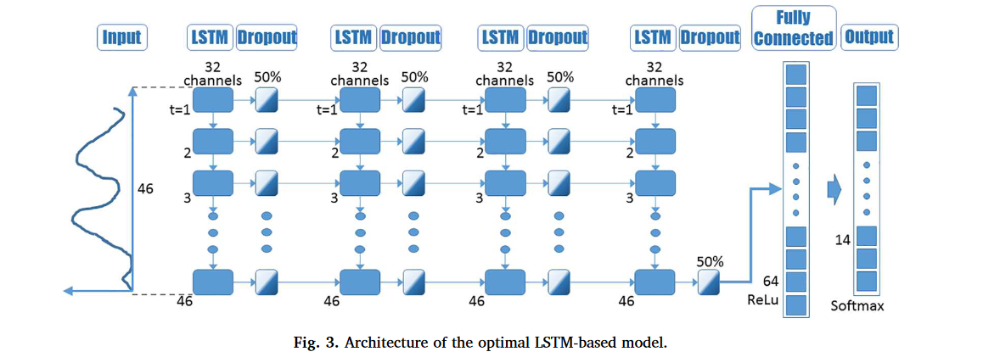

在LSTM模型中，每个隐藏层的通道数目==通常是一致的==，这是因为LSTM模型的结构决定了每个隐藏层内部的结构是相同的。具体来说，每个LSTM层内部包含了多个LSTM单元（cell），每个LSTM单元中都有一组相同的参数（如遗忘门、输入门、输出门等），这些参数的数量决定了隐藏层的通道数目

# 资源
https://paddlepedia.readthedocs.io/en/latest/tutorials/CNN/convolution_operator/3D_Convolution.html