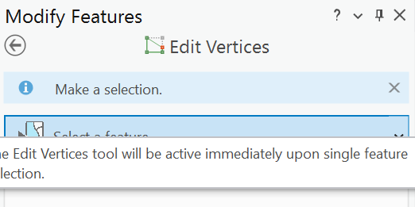
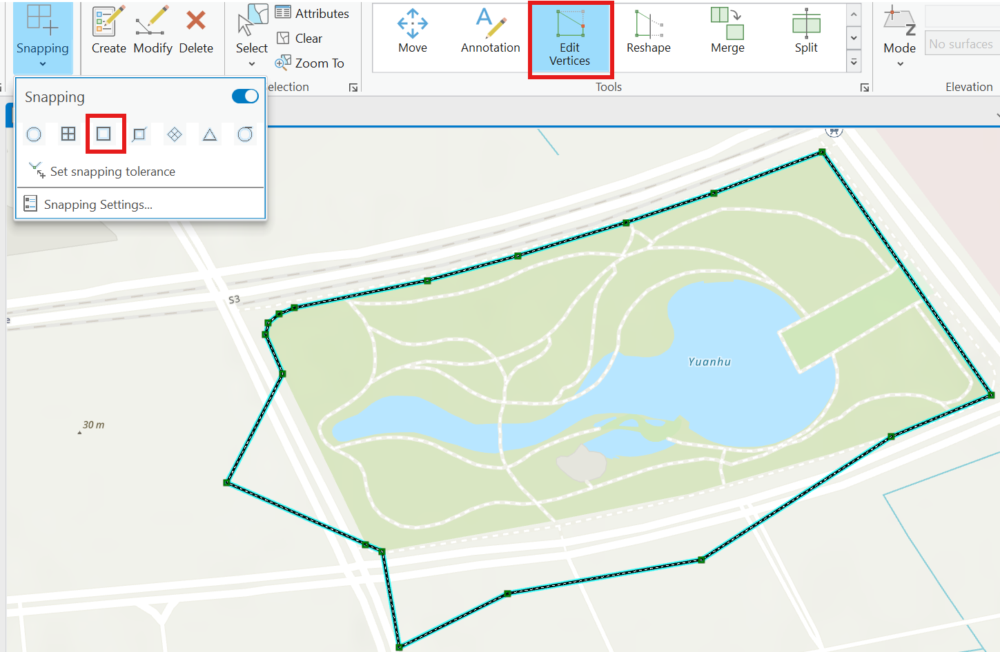
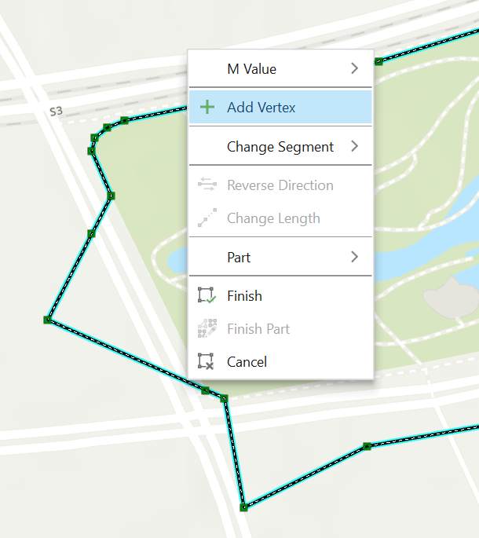
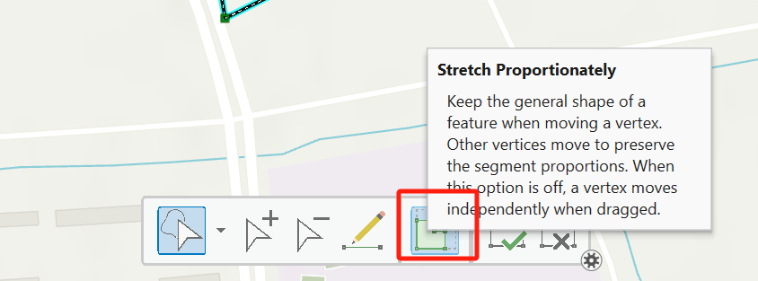

# edit
Edit tool select the feature you want to edit,open snapping. 
right click the feature, add vertice, then move the vertice to the places you want. To advoid moving the whole feature, close the ==Stretch proportionately==option.

