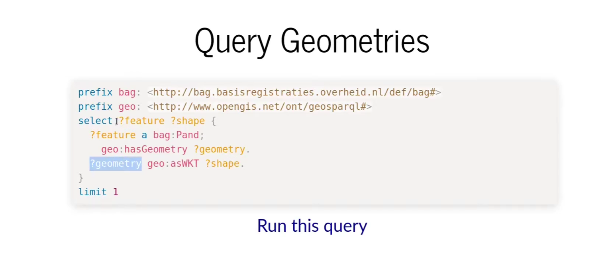
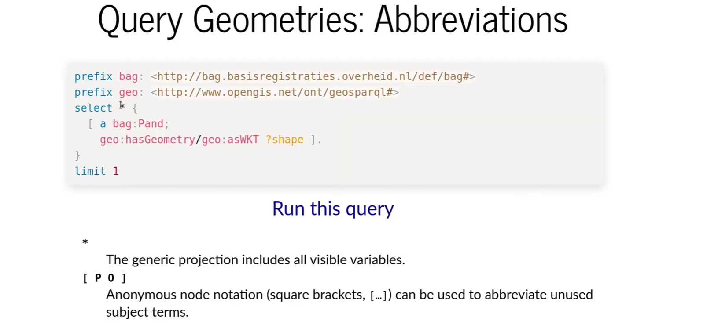
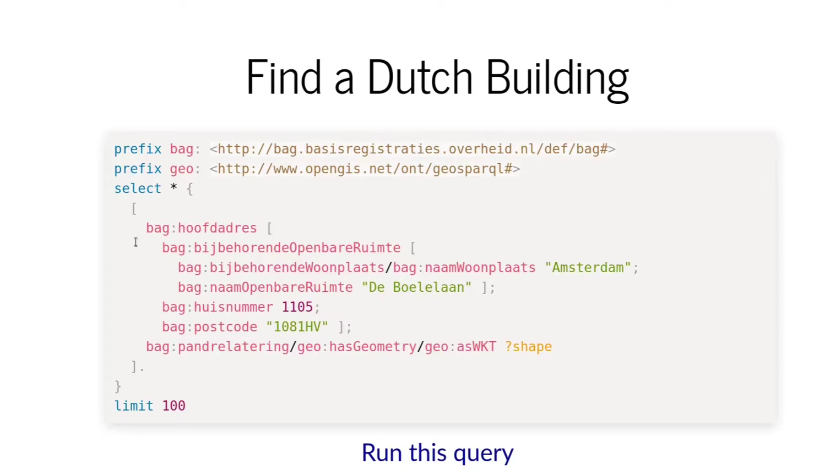

https://geokg-sigspatial.github.io/geokg2022/

https://ar5iv.labs.arxiv.org/html/2109.10036
## 三元组（triple）
知识图谱的三元组（triple）是构建和表达知识图谱数据的基本单位。
每个三元组由三个部分组成：主体（subject）、谓词（predicate）、宾语（object）.这种结构有助于表达实体之间的语义关系，是资源描述框架（RDF）中表达数据的一种方式.
>贝多芬创建了月光
主体（Subject）：通常指的是一个实体或者资源，例如一个人、地点、事件或事物。
谓词（Predicate）：描述了主体和宾语之间的关系，它通常是一个动词或者关系表达，如“位于”、“拥有”、“创作”等。
宾语（Object）：可以是另一个实体或资源，或者是一些数据值（如字符串、数字等）
[triple](https://docs.triply.cc/)


### application
[DBpedia](https://www.dbpedia.org/)和Wikidata


## SPARQL
SPARQL是一种RDF数据查询语言，用于查询、添加、修改和删除RDF图中的数据<br>
[Geosparql](https://opengeospatial.github.io/ogc-geosparql/)


```bash
PREFIX xsd: <http://www.w3.org/2001/XMLSchema#>
PREFIX geo: <http://www.opengis.net/ont/geosparql#>
prefix rdf: <http://www.w3.org/1999/02/22-rdf-syntax-ns#>
prefix rdfs: <http://www.w3.org/2000/01/rdf-schema#>
prefix skos: <http://www.w3.org/2004/02/skos/core#>
PREFIX sor: <https://data.kkg.kadaster.nl/sor/model/def/>
PREFIX nen3610: <https://data.kkg.kadaster.nl/nen3610/model/def/>
prefix ladm: <https://data.labs.kadaster.nl/2024/ladm#>

SELECT ?addressDetails ?document
where 
{
  { select * {
      {
        #step 1: find building associated with an address
        ?adres  # subject 主体(实体)
          ladm:postalCode ?postcode ; # ladm:postalCode谓语 (关系，属性);?postcode object (客体，属性值，另一个实体)
          ladm:houseNumber ?housenumber ; 
		  ladm:streetName ?streetname ;
		  ladm:cityName ?cityName . 
        optional { ?adres ladm:NL_addressLetter ?houseletter }
        optional { ?adres ladm:NL_addressNumberAddition ?housenumberaddition }
      }

      ?adres ladm:NL_belongsToSpatialUnit ?buildingunit .
      ?buildingunit ladm:NL_belongsToSpatialUnit ?building .
    }
  }
  
  #step 2: search for the spatial plan (if any) associated with the building 
  ?spatialplan 
    a ladm:SP_PlanUnit ;
    geo:sfOverlaps ?building ;
	ladm:NL_designatedArea ?bestemming ;
	ladm:NL_spatialPlan ?spatialplandocument ;
 	ladm:spID ?spId .
  
  bind(concat(str(?streetname),' ',str(?housenumber),
      if(bound(?houseletter),concat(str(?houseletter)),''),
      if(bound(?housenumberaddition),concat('-',str(?housenumberaddition)),''),', ',str(?postcode),', ',str(?cityName)) as ?addressDetails)
  
  bind(uri(str(?spatialplandocument)) as ?document )
}
limit 5


## Neo4j
Cypher是Neo4j的查询语言，用于创建、查询和修改图形数据

## Geosparsql
geometry shape is one variablle
normal query

simplify the query


