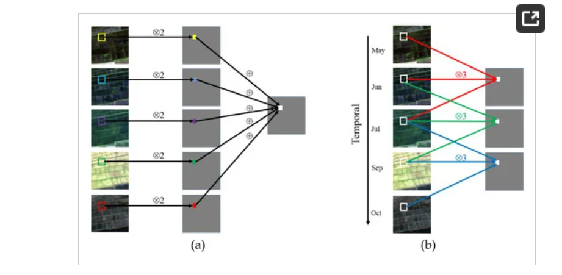
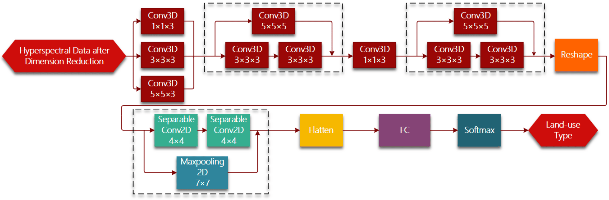

# SAR data的缺点
>Mapping tobacco planting areas in smallholder farmlands using Phenological-Spatial-Temporal LSTM from time-series Sentinel-1 SAR images
>>Moreover, ==SAR signals may be affected by environmental factors like terrain== and climate conditions. Optimizing the processing of time series SAR data may also improve the derivation of phenological information\

# 3D CNN Spatial-temporary
2019-RS-3D Convolutional Neural Networks for Crop Classification with Multi-Temporal Remote Sensing Images

# 3D CNN spatial-spectral
+ ==2021-Computers and Electronics in Agriculture -Deep learning-based crop mapping in the cloudy season using one-shot hyperspectral satellite imagery==
  + 学习写作
  +  1D 2D 3DCNN的比较
+ 2019-sensor-75citation-Learning Deep Hierarchical Spatial–Spectral Features
 for Hyperspectral Image Classification Based on
 Residual 3D-2D CNN

 
 
